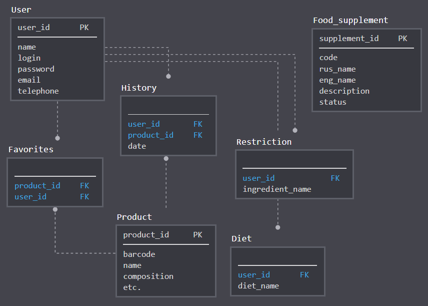

**Отчет по БД (на 14.11.18)**

**1. Предлагаю уточнить термины:**

Избранное – список интересующих продуктов, которые пользователь может добавлять.
Сохраняется в БД.

Список покупок – корзина, в которую пользователь может добавлять продукты во
время покупок для оценки общей полезности и т.д. Можно очищать при каждом походе
в магазин. Не сохраняется в БД.

История покупок – список, в который добавляется продукт каждый раз, когда
пользователь открывает его описание. Сохраняется в БД.

**2. Необходимо разграничить понятия:**

Объективная польза/вред продукта – полезно/вредно для всех людей и оценивается с
точки зрения наличия вредных пищевых добавок. Предлагаю использовать таблицу:
<http://pomni.info/pomni/home/view/pishevie_dobavki.html>. Здесь можно ссылаться
на Минздрав и экологическую экспертизу КЕДР, где указан статус добавки.

Индивидуальные ограничения для разных групп людей. Предлагаю сделать так:
пользователь может выбрать для себя комплексные диеты/ограничения (например
халяльная еда, непереносимость лактозы и т.д.). А также создать для себя
индивидуальный список и указать ингредиенты/вещества, в которых он бы хотел себя
ограничить (например, аллергия на арахис).

Соответственно, для каждой диеты необходимо изучить материал, найти достоверный
источник, на который можно ссылаться, также найти список конкретных
продуктов/веществ, которые включает в себя данная диета.

**3. Примерный список сущностей:**

Пользователь – хранятся данные о пользователе. Индивидуальные непереносимости и
диеты думаю лучше хранить в отдельных таблицах.

Продукт – данные о продукте.

Избранное – список интересующих продуктов пользователя.

История покупок – история поиска продуктов для каждого пользователя с указанием
даты.

Пищевые добавки – список добавок с их описанием и указанием статуса.

Ограничения – список не желаемых продуктов/веществ для каждого пользователя.

Диеты – список диет для каждого пользователя.

По мере добавления новых диет будут добавляться связанные с ними таблицы.

**4. Логическая схема БД:**

